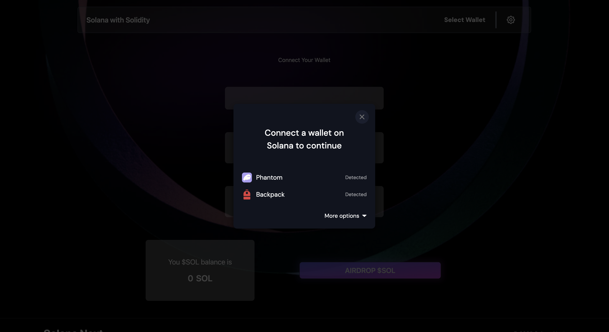

# Mint And Transfer Fungible SPL Tokens with Solang Solidity

## Introduction

This is a simple example of how to mint and transfer fungible SPL tokens.

## Prerequisites

This is a react project, so you need to have nodejs installed. You can download it from [here](https://nodejs.org/en/download/).

## Installation

Clone the repository and install the dependencies:

```bash
git clone
cd spl-token-solana
npm install
```

## Usage

Start the project:

```bash
npm run dev
```

Open http://localhost:3000 with your browser to see the DApp.

## License

[MIT](https://choosealicense.com/licenses/mit/)

## Using the DAPP

1. Connect your wallet to the DAPP by clicking on the "Select Wallet" button.
   
   Now you can check your balance at the bottom of the DApp, also you can airdrop devnet sol to your wallet
   YOu can switch the network of the dapp from the header.

2. Now click on create mint to create the token mint, once you sign the transaction and create the mint you will get the token mint address.

3. Now you create token account in which you want to mint the tokens, you can create multiple token accounts, once you sign the transaction you will get the token account address.

4. Now you can mint the tokens to the token account you created, you can mint multiple times, once you sign the transaction you will get the transaction id.

5. Now you can transfer the tokens to any token account, once you sign the transaction you will get the transaction id.

## Creating the similar DApp

1. To create the similar Dapp you need to have pre knowledge of react and basic solana spl.
2. You can use the code from the repository and modify it according to your need.
3. You can also use the code from the repository and deploy it on vercel or netlify to create your own DApp.
