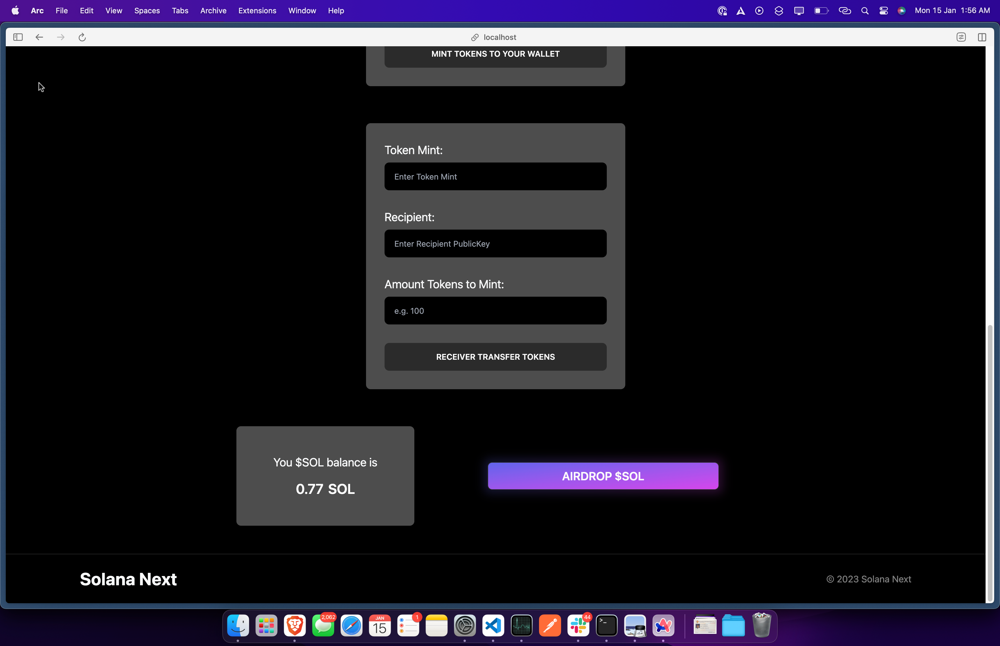
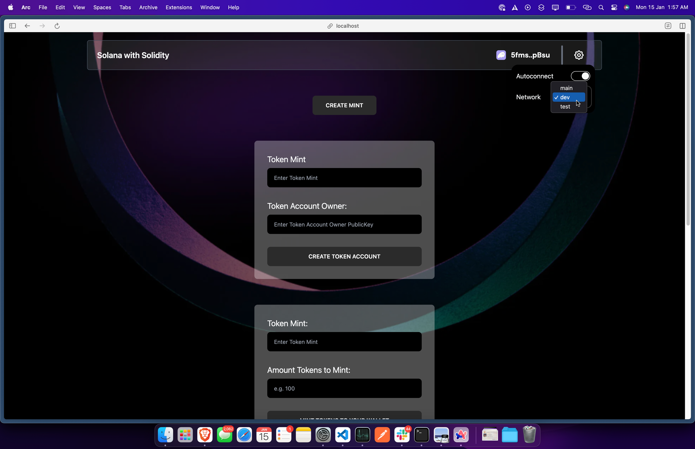
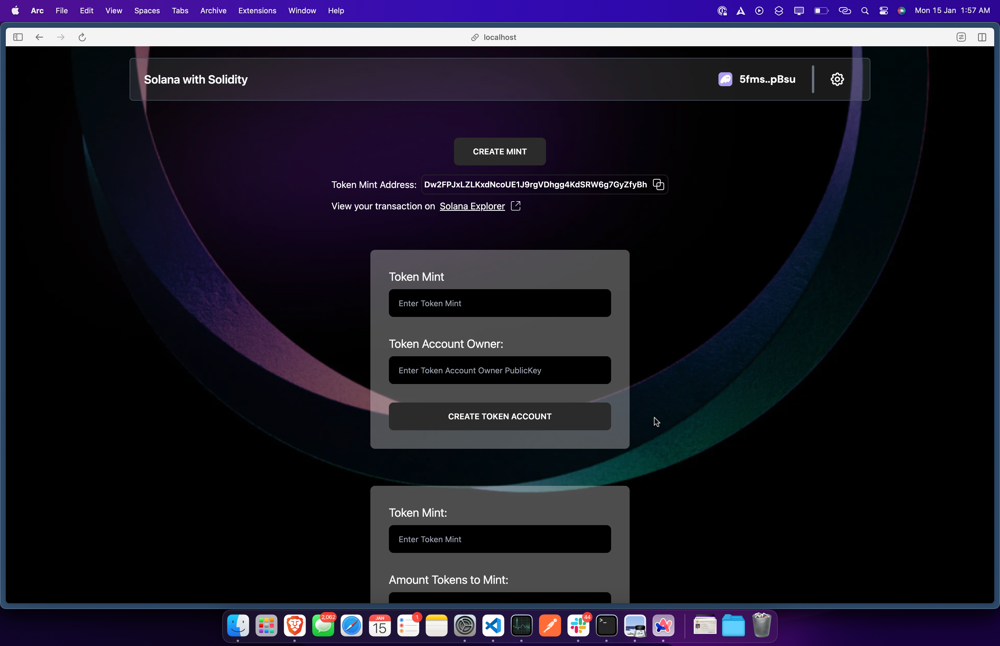
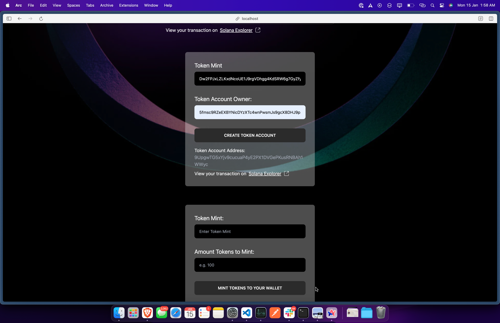
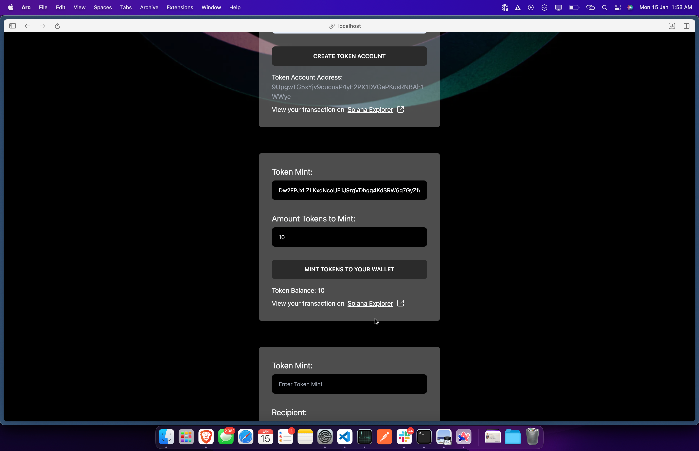
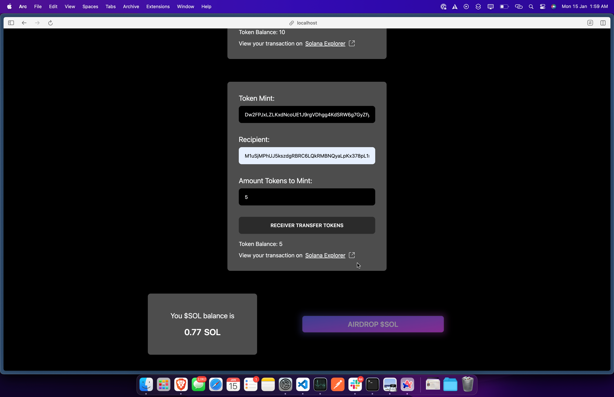

# Mint And Transfer Fungible SPL Tokens with Solang Solidity

## Introduction

This is a simple example of how to mint and transfer fungible SPL tokens.

## Prerequisites

This is a react project, so you need to have nodejs installed. You can download it from [here](https://nodejs.org/en/download/).

## Installation

Clone the repository and install the dependencies:

```bash
git clone
cd spl-token-solana
npm install
```

## Usage

Start the project:

```bash
npm run dev
```

Open http://localhost:3000 with your browser to see the DApp.

## License

[MIT](https://choosealicense.com/licenses/mit/)

## Using the DAPP

1. Connect your wallet to the DAPP by clicking on the "Select Wallet" button.
   
   Now you can check your balance at the bottom of the DApp, also you can airdrop devnet sol to your wallet
   
   You can switch the network of the dapp from the header.
   

2. Now click on create mint to create the token mint, once you sign the transaction and create the mint you will get the token mint address.
   

3. Now you create token account in which you want to mint the tokens, you can create multiple token accounts, once you sign the transaction you will get the token account address.
   

4. Now you can mint the tokens to the token account you created, you can mint multiple times, once you sign the transaction you will get the transaction id.
   

5. Now you can transfer the tokens to any token account, once you sign the transaction you will get the transaction id.
   

## Creating the similar DApp

1. To create the similar Dapp you need to have pre knowledge of react and basic of spl token.
2. You can use the code from the repository and modify it according to your need.
3. You can also use the code from the repository and deploy it on vercel or netlify to create your own DApp.

## Code Explanation

To create a new SPL-Token you first have to create a Token Mint. A Token Mint is the account that holds data about a specific token.

```javascript
await program.methods
    .createTokenMint(
        wallet.publicKey, // freeze authority
        9, // 0 decimals for NFT
        tokenTitle, // NFT name
        tokenSymbol, // NFT symbol
        tokenUri // NFT URI
    )
    .accounts({
        payer: wallet.publicKey,
        mint: mintKeypair.publicKey,
        metadata: metadataAddress,
        mintAuthority: wallet.publicKey,
        rentAddress: SYSVAR_RENT_PUBKEY,
        metadataProgramId: new PublicKey("metaqbxxUerdq28cj1RbAWkYQm3ybzjb6a8bt518x1s"),
    })
    .signers([mintKeypair])
    .rpc({ skipPreflight: true });
```

Once you have created the Token Mint, you can create a Token Account. A Token Account is the account that holds the balance of a specific token.
Only the owner is authorized to decrease the Token Account balance (transfer, burn, etc.) while anyone can send tokens to the Token Account to increase its balance.

```javascript
createAssociatedTokenAccountInstruction(
    publicKey,
    associatedToken,
    owner,
    mint,
    TOKEN_PROGRAM_ID,
    ASSOCIATED_TOKEN_PROGRAM_ID
);
```

Once you have created the Token Account, you can mint tokens to the Token Account.

Amount here should be a BIGINT.

```javascript
await program.methods
    .mintTo(amount)
    .accounts({
        mint: mintKeypair.publicKey,
        tokenAccount: associatedTokenAccount,
        mintAuthority: wallet.publicKey,
    })
    .rpc({ skipPreflight: true });
```

Once you have minted the tokens, you can transfer the tokens to any Token Account.

```javascript
await program.methods
    .transferTokens(amount)
    .accounts({
        from: fromTokenAccount,
        to: toTokenAccount,
        owner: senderPublicKey,
    })
    .rpc({ skipPreflight: true });
```
